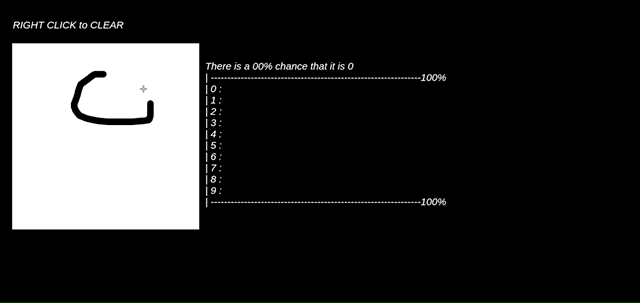

# tensorflow-mnist-tutorial
MNIST classification in Tensorflow using Django

https://tensorflow-mnist-tutorial.herokuapp.com/


It might take some time to load this webpage. Please wait :)



https://www.youtube.com/watch?v=oaSu3NjladU


## Requirements
- Python 3
- Tensorflow > 0.12
- Numpy
- Django (2, 0, 1, 'final', 0)


## Training
```bash
python train.py
```


## Run Server
```bash
python manage.py runserver 0.0.0.0:8000
```

### Deploy to Heroku ###
    $ heroku apps:create [NAME]
    $ git push heroku master

## References
 - https://hunkim.github.io/ml/
